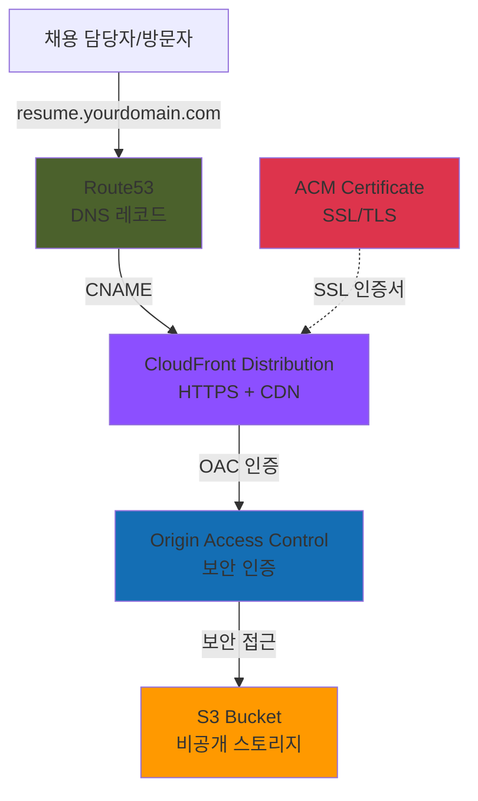

# 설계 문서: Resume Hosting Infrastructure

## 개요

본 설계는 Terraform을 사용하여 AWS에서 PDF 이력서를 호스팅하는 인프라를 구현합니다. 이 시스템은 S3를 스토리지로, CloudFront를 CDN으로, Route53을 DNS 관리로, ACM을 SSL 인증서 관리로 사용하여 안전하고 빠르며 비용 효율적인 이력서 호스팅 솔루션을 제공합니다.

핵심 설계 원칙:
- **보안 우선**: S3 버킷은 비공개로 유지하고 Origin Access Control(OAC)을 통해서만 접근
- **성능 최적화**: CloudFront CDN을 통한 전 세계적 콘텐츠 전송
- **비용 효율성**: AWS 프리 티어 범위 내에서 작동하도록 최적화
- **Infrastructure as Code**: 모든 리소스를 Terraform으로 관리하여 재현 가능하고 버전 관리 가능
- **HTTPS 강제**: 모든 트래픽에 대해 SSL/TLS 암호화 적용

## 아키텍처

### 전체 아키텍처 다이어그램



### 데이터 흐름

1. **요청 단계**: 사용자가 커스텀 도메인(예: resume.yourdomain.com)으로 이력서 요청
2. **DNS 해석**: Route53이 도메인을 CloudFront 배포 도메인으로 해석
3. **CDN 처리**: CloudFront가 요청을 받고 캐시 확인
4. **캐시 미스 시**: CloudFront가 OAC를 사용하여 S3에서 이력서 PDF 가져오기
5. **캐시 히트 시**: CloudFront가 엣지 로케이션에서 직접 제공
6. **응답**: HTTPS를 통해 사용자에게 PDF 전송

### Terraform 프로젝트 구조

```
resume-hosting-infrastructure/
├── main.tf                 # 메인 Terraform 구성
├── variables.tf            # 입력 변수 정의
├── outputs.tf              # 출력 값 정의
├── providers.tf            # AWS 프로바이더 구성
├── s3.tf                   # S3 버킷 리소스
├── cloudfront.tf           # CloudFront 배포 리소스
├── route53.tf              # Route53 DNS 레코드
├── acm.tf                  # ACM 인증서 리소스
├── iam.tf                  # IAM 정책 및 역할
├── terraform.tfvars        # 변수 값 (gitignore)
└── README.md               # 사용 가이드
```

## 컴포넌트 및 인터페이스

### 1. S3 버킷 (s3.tf)

**목적**: PDF 이력서 파일을 안전하게 저장

**리소스 구성**:
```hcl
resource "aws_s3_bucket" "resume_bucket" {
  bucket = var.bucket_name
  
  tags = {
    Name        = "Resume Hosting Bucket"
    Environment = var.environment
    ManagedBy   = "Terraform"
  }
}

resource "aws_s3_bucket_versioning" "resume_versioning" {
  bucket = aws_s3_bucket.resume_bucket.id
  
  versioning_configuration {
    status = "Enabled"
  }
}

resource "aws_s3_bucket_public_access_block" "resume_public_access_block" {
  bucket = aws_s3_bucket.resume_bucket.id
  
  block_public_acls       = true
  block_public_policy     = true
  ignore_public_acls      = true
  restrict_public_buckets = true
}
```

**주요 특징**:
- 버전 관리 활성화: 이력서 업데이트 추적 및 롤백 가능
- 공개 접근 차단: 모든 공개 접근 차단 설정 활성화
- Standard 스토리지 클래스: 프리 티어 최적화
- 최소 구성: 불필요한 기능(분석, 복제, 수명 주기) 비활성화

**버킷 정책**:
```hcl
resource "aws_s3_bucket_policy" "resume_bucket_policy" {
  bucket = aws_s3_bucket.resume_bucket.id
  
  policy = jsonencode({
    Version = "2012-10-17"
    Statement = [
      {
        Sid    = "AllowCloudFrontServicePrincipal"
        Effect = "Allow"
        Principal = {
          Service = "cloudfront.amazonaws.com"
        }
        Action   = "s3:GetObject"
        Resource = "${aws_s3_bucket.resume_bucket.arn}/*"
        Condition = {
          StringEquals = {
            "AWS:SourceArn" = aws_cloudfront_distribution.resume_distribution.arn
          }
        }
      }
    ]
  })
}
```

### 2. CloudFront 배포 (cloudfront.tf)

**목적**: 전 세계적으로 이력서를 빠르게 전송하고 HTTPS 제공

**Origin Access Control (OAC) 구성**:

AWS는 2022년 8월부터 Origin Access Control(OAC)을 권장하며, 이는 기존 Origin Access Identity(OAI)를 대체합니다. OAC는 다음과 같은 이점을 제공합니다:
- 모든 AWS 리전의 S3 버킷 지원 (2022년 12월 이후 출시된 리전 포함)
- AWS KMS를 사용한 S3 서버 측 암호화(SSE-KMS) 지원
- PUT 및 DELETE와 같은 동적 요청 지원

```hcl
resource "aws_cloudfront_origin_access_control" "resume_oac" {
  name                              = "resume-oac-${var.environment}"
  description                       = "OAC for Resume S3 Bucket"
  origin_access_control_origin_type = "s3"
  signing_behavior                  = "always"
  signing_protocol                  = "sigv4"
}
```

**CloudFront 배포 구성**:
```hcl
resource "aws_cloudfront_distribution" "resume_distribution" {
  enabled             = true
  is_ipv6_enabled     = true
  comment             = "Resume hosting distribution"
  default_root_object = var.resume_filename
  price_class         = "PriceClass_100"  # 북미, 유럽만 - 비용 최적화
  
  aliases = [var.custom_domain]
  
  origin {
    domain_name              = aws_s3_bucket.resume_bucket.bucket_regional_domain_name
    origin_id                = "S3-${aws_s3_bucket.resume_bucket.id}"
    origin_access_control_id = aws_cloudfront_origin_access_control.resume_oac.id
  }
  
  default_cache_behavior {
    allowed_methods        = ["GET", "HEAD", "OPTIONS"]
    cached_methods         = ["GET", "HEAD"]
    target_origin_id       = "S3-${aws_s3_bucket.resume_bucket.id}"
    viewer_protocol_policy = "redirect-to-https"
    compress               = true
    
    forwarded_values {
      query_string = false
      cookies {
        forward = "none"
      }
    }
    
    min_ttl     = 0
    default_ttl = 86400    # 24시간
    max_ttl     = 31536000 # 1년
  }
  
  viewer_certificate {
    acm_certificate_arn      = aws_acm_certificate.resume_cert.arn
    ssl_support_method       = "sni-only"
    minimum_protocol_version = "TLSv1.2_2021"
  }
  
  restrictions {
    geo_restriction {
      restriction_type = "none"
    }
  }
  
  tags = {
    Name        = "Resume Distribution"
    Environment = var.environment
    ManagedBy   = "Terraform"
  }
}
```

**주요 특징**:
- **Price Class 100**: 북미와 유럽만 사용하여 비용 절감 (프리 티어 최적화)
- **HTTPS 강제**: `redirect-to-https`로 모든 HTTP 요청을 HTTPS로 리디렉션
- **압축 활성화**: 대역폭 절약 및 전송 속도 향상
- **캐싱 전략**: 24시간 기본 TTL로 S3 요청 최소화
- **SNI 전용 SSL**: 추가 비용 없는 SSL 지원 방식

### 3. ACM 인증서 (acm.tf)

**목적**: 커스텀 도메인에 대한 무료 SSL/TLS 인증서 제공

**중요**: CloudFront용 ACM 인증서는 반드시 `us-east-1` 리전에서 생성해야 합니다.

```hcl
provider "aws" {
  alias  = "us_east_1"
  region = "us-east-1"
}

resource "aws_acm_certificate" "resume_cert" {
  provider          = aws.us_east_1
  domain_name       = var.custom_domain
  validation_method = "DNS"
  
  lifecycle {
    create_before_destroy = true
  }
  
  tags = {
    Name        = "Resume Certificate"
    Environment = var.environment
    ManagedBy   = "Terraform"
  }
}

resource "aws_acm_certificate_validation" "resume_cert_validation" {
  provider                = aws.us_east_1
  certificate_arn         = aws_acm_certificate.resume_cert.arn
  validation_record_fqdns = [for record in aws_route53_record.cert_validation : record.fqdn]
}
```

**검증 프로세스**:
1. ACM이 DNS 검증 레코드 생성
2. Terraform이 자동으로 Route53에 검증 레코드 추가
3. ACM이 도메인 소유권 확인
4. 인증서 발급 (일반적으로 5-30분 소요)

### 4. Route53 DNS (route53.tf)

**목적**: 커스텀 도메인을 CloudFront 배포에 연결

**가정**: Route53 호스팅 영역이 이미 존재한다고 가정 (별도로 생성 필요)

```hcl
data "aws_route53_zone" "main" {
  name         = var.root_domain
  private_zone = false
}

resource "aws_route53_record" "resume" {
  zone_id = data.aws_route53_zone.main.zone_id
  name    = var.custom_domain
  type    = "A"
  
  alias {
    name                   = aws_cloudfront_distribution.resume_distribution.domain_name
    zone_id                = aws_cloudfront_distribution.resume_distribution.hosted_zone_id
    evaluate_target_health = false
  }
}

resource "aws_route53_record" "cert_validation" {
  for_each = {
    for dvo in aws_acm_certificate.resume_cert.domain_validation_options : dvo.domain_name => {
      name   = dvo.resource_record_name
      record = dvo.resource_record_value
      type   = dvo.resource_record_type
    }
  }
  
  zone_id = data.aws_route53_zone.main.zone_id
  name    = each.value.name
  type    = each.value.type
  records = [each.value.record]
  ttl     = 60
}
```

**주요 특징**:
- **A 레코드 Alias**: CloudFront 배포를 직접 가리킴 (CNAME보다 효율적)
- **자동 인증서 검증**: ACM 검증 레코드 자동 생성
- **기존 호스팅 영역 사용**: 새 호스팅 영역 생성 비용 절감

## 데이터 모델

### Terraform 변수 (variables.tf)

```hcl
variable "aws_region" {
  description = "AWS 리전"
  type        = string
  default     = "us-east-1"
}

variable "environment" {
  description = "환경 이름 (dev, staging, prod)"
  type        = string
  default     = "prod"
}

variable "bucket_name" {
  description = "S3 버킷 이름 (전역적으로 고유해야 함)"
  type        = string
  validation {
    condition     = can(regex("^[a-z0-9][a-z0-9-]*[a-z0-9]$", var.bucket_name))
    error_message = "버킷 이름은 소문자, 숫자, 하이픈만 포함해야 하며 하이픈으로 시작하거나 끝날 수 없습니다."
  }
}

variable "resume_filename" {
  description = "S3에 업로드할 이력서 PDF 파일 이름"
  type        = string
  default     = "resume.pdf"
  validation {
    condition     = can(regex("\\.pdf$", var.resume_filename))
    error_message = "이력서 파일 이름은 .pdf로 끝나야 합니다."
  }
}

variable "custom_domain" {
  description = "이력서를 위한 커스텀 도메인 (예: resume.yourdomain.com)"
  type        = string
  validation {
    condition     = can(regex("^[a-z0-9][a-z0-9.-]*[a-z0-9]$", var.custom_domain))
    error_message = "유효한 도메인 이름을 제공해야 합니다."
  }
}

variable "root_domain" {
  description = "Route53 호스팅 영역의 루트 도메인 (예: yourdomain.com)"
  type        = string
  validation {
    condition     = can(regex("^[a-z0-9][a-z0-9.-]*[a-z0-9]$", var.root_domain))
    error_message = "유효한 도메인 이름을 제공해야 합니다."
  }
}

variable "tags" {
  description = "모든 리소스에 적용할 추가 태그"
  type        = map(string)
  default     = {}
}
```

### Terraform 출력 (outputs.tf)

```hcl
output "s3_bucket_name" {
  description = "생성된 S3 버킷 이름"
  value       = aws_s3_bucket.resume_bucket.id
}

output "s3_bucket_arn" {
  description = "S3 버킷 ARN"
  value       = aws_s3_bucket.resume_bucket.arn
}

output "cloudfront_distribution_id" {
  description = "CloudFront 배포 ID"
  value       = aws_cloudfront_distribution.resume_distribution.id
}

output "cloudfront_domain_name" {
  description = "CloudFront 배포 도메인 이름"
  value       = aws_cloudfront_distribution.resume_distribution.domain_name
}

output "cloudfront_url" {
  description = "CloudFront를 통한 이력서 전체 URL"
  value       = "https://${aws_cloudfront_distribution.resume_distribution.domain_name}/${var.resume_filename}"
}

output "custom_domain_url" {
  description = "커스텀 도메인을 통한 이력서 URL"
  value       = "https://${var.custom_domain}/${var.resume_filename}"
}

output "acm_certificate_arn" {
  description = "ACM 인증서 ARN"
  value       = aws_acm_certificate.resume_cert.arn
}

output "route53_record_name" {
  description = "Route53 레코드 이름"
  value       = aws_route53_record.resume.name
}

output "upload_command" {
  description = "이력서를 S3에 업로드하는 AWS CLI 명령"
  value       = "aws s3 cp ${var.resume_filename} s3://${aws_s3_bucket.resume_bucket.id}/${var.resume_filename} --content-type application/pdf"
}

output "invalidate_cache_command" {
  description = "CloudFront 캐시를 무효화하는 AWS CLI 명령"
  value       = "aws cloudfront create-invalidation --distribution-id ${aws_cloudfront_distribution.resume_distribution.id} --paths '/*'"
}
```

### 프로바이더 구성 (providers.tf)

```hcl
terraform {
  required_version = ">= 1.0"
  
  required_providers {
    aws = {
      source  = "hashicorp/aws"
      version = "~> 5.0"
    }
  }
  
  # 선택사항: 원격 상태 저장소 (S3 + DynamoDB)
  # backend "s3" {
  #   bucket         = "your-terraform-state-bucket"
  #   key            = "resume-hosting/terraform.tfstate"
  #   region         = "us-east-1"
  #   encrypt        = true
  #   dynamodb_table = "terraform-state-lock"
  # }
}

provider "aws" {
  region = var.aws_region
  
  default_tags {
    tags = merge(
      {
        Project   = "Resume Hosting"
        ManagedBy = "Terraform"
      },
      var.tags
    )
  }
}

provider "aws" {
  alias  = "us_east_1"
  region = "us-east-1"
  
  default_tags {
    tags = merge(
      {
        Project   = "Resume Hosting"
        ManagedBy = "Terraform"
      },
      var.tags
    )
  }
}
```

## 보안 고려사항

### 1. S3 버킷 보안

**비공개 버킷 강제**:
- 모든 공개 접근 차단 설정 활성화
- 버킷 정책은 CloudFront OAC만 허용
- 직접 S3 URL 접근 불가능

**버전 관리**:
- 실수로 삭제된 이력서 복구 가능
- 이전 버전으로 롤백 가능
- 변경 이력 추적

### 2. CloudFront 보안

**HTTPS 강제**:
- 모든 HTTP 요청을 HTTPS로 리디렉션
- TLS 1.2 이상만 허용
- 최신 암호화 프로토콜 사용

**Origin Access Control (OAC)**:
- S3 버킷에 대한 직접 접근 차단
- CloudFront만 S3에 접근 가능
- AWS SigV4 서명을 사용한 인증

**헤더 보안**:
```hcl
# cloudfront.tf에 추가 가능한 보안 헤더
custom_header {
  name  = "X-Content-Type-Options"
  value = "nosniff"
}

custom_header {
  name  = "X-Frame-Options"
  value = "DENY"
}

custom_header {
  name  = "X-XSS-Protection"
  value = "1; mode=block"
}
```

### 3. IAM 최소 권한 원칙

**Terraform 실행을 위한 IAM 정책**:
```json
{
  "Version": "2012-10-17",
  "Statement": [
    {
      "Effect": "Allow",
      "Action": [
        "s3:CreateBucket",
        "s3:DeleteBucket",
        "s3:GetBucketVersioning",
        "s3:PutBucketVersioning",
        "s3:GetBucketPolicy",
        "s3:PutBucketPolicy",
        "s3:GetBucketPublicAccessBlock",
        "s3:PutBucketPublicAccessBlock"
      ],
      "Resource": "arn:aws:s3:::*"
    },
    {
      "Effect": "Allow",
      "Action": [
        "cloudfront:CreateDistribution",
        "cloudfront:DeleteDistribution",
        "cloudfront:GetDistribution",
        "cloudfront:UpdateDistribution",
        "cloudfront:CreateOriginAccessControl",
        "cloudfront:DeleteOriginAccessControl",
        "cloudfront:GetOriginAccessControl",
        "cloudfront:CreateInvalidation"
      ],
      "Resource": "*"
    },
    {
      "Effect": "Allow",
      "Action": [
        "acm:RequestCertificate",
        "acm:DeleteCertificate",
        "acm:DescribeCertificate",
        "acm:ListCertificates"
      ],
      "Resource": "*"
    },
    {
      "Effect": "Allow",
      "Action": [
        "route53:GetHostedZone",
        "route53:ListHostedZones",
        "route53:ChangeResourceRecordSets",
        "route53:GetChange",
        "route53:ListResourceRecordSets"
      ],
      "Resource": "*"
    }
  ]
}
```

### 4. 비밀 정보 관리

**민감한 정보 보호**:
- `terraform.tfvars` 파일을 `.gitignore`에 추가
- AWS 자격 증명을 코드에 하드코딩하지 않음
- 환경 변수 또는 AWS 프로파일 사용
- Terraform Cloud 또는 AWS Secrets Manager 사용 고려

## 비용 최적화 전략

### AWS 프리 티어 한도

**S3 프리 티어** (12개월):
- 5GB Standard 스토리지
- 20,000 GET 요청/월
- 2,000 PUT 요청/월

**CloudFront 프리 티어** (항상 무료):
- 1TB 데이터 전송/월
- 10,000,000 HTTP/HTTPS 요청/월

**Route53 비용**:
- 호스팅 영역: $0.50/월
- 쿼리: 처음 100만 개 무료

**ACM**:
- 공개 SSL/TLS 인증서: 무료

### 비용 절감 전략

1. **Price Class 최적화**:
   - `PriceClass_100` 사용 (북미, 유럽만)
   - 전 세계 배포가 필요 없는 경우 비용 절감

2. **캐싱 최적화**:
   - 긴 TTL 설정으로 S3 요청 최소화
   - 압축 활성화로 데이터 전송량 감소

3. **불필요한 기능 비활성화**:
   - S3 분석, 복제, 수명 주기 정책 비활성화
   - CloudFront 로깅 비활성화 (필요시에만 활성화)

4. **단일 파일 호스팅**:
   - 이력서 PDF 하나만 호스팅
   - 추가 파일 없음

5. **모니터링**:
   - AWS Budgets 설정으로 비용 초과 알림
   - CloudWatch 알람으로 사용량 모니터링

### 예상 월간 비용

**프리 티어 범위 내 사용 시**:
- S3: $0 (단일 PDF 파일, 5GB 미만)
- CloudFront: $0 (1TB 미만 전송)
- Route53: $0.50 (호스팅 영역)
- ACM: $0 (무료)
- **총 예상 비용: $0.50/월**

**프리 티어 초과 시** (예: 월 10,000 방문자):
- S3: ~$0.01 (GET 요청)
- CloudFront: ~$0.85 (데이터 전송)
- Route53: $0.50
- **총 예상 비용: ~$1.36/월**


## 정확성 속성 (Correctness Properties)

속성(Property)은 시스템의 모든 유효한 실행에서 참이어야 하는 특성 또는 동작입니다. 본질적으로 시스템이 수행해야 하는 작업에 대한 공식적인 명세입니다. 속성은 사람이 읽을 수 있는 명세와 기계가 검증할 수 있는 정확성 보장 사이의 다리 역할을 합니다.

### 속성 반영 (Property Reflection)

사전 작업 분석을 검토한 결과, 대부분의 수락 기준은 Terraform 인프라 구성의 특정 예제 테스트에 해당합니다. 다음과 같은 중복을 식별했습니다:

**중복 제거된 속성**:
- 3.4는 3.1과 동일 (HTTP to HTTPS 리디렉션)
- 4.2는 4.1과 동일 (Route53 레코드 매핑)
- 4.5는 4.3과 유사 (커스텀 도메인 요청 수락)
- 6.2는 2.5와 동일 (캐시 무효화 메커니즘)
- 6.3은 6.1과 유사 (업데이트 후 새 파일 제공)
- 7.3은 7.1과 동일 (인증 없는 공개 접근)
- 7.4는 7.1과 유사 (서명된 URL 불필요)
- 8.9는 8.7과 유사 (최소 리소스 사용)

**속성 기반 테스트 vs 예제 테스트**:

이 인프라 프로젝트의 특성상, 대부분의 테스트는 Terraform 구성의 정확성을 검증하는 예제 테스트입니다. 그러나 다음과 같은 속성 기반 테스트를 식별할 수 있습니다:

1. **메타데이터 보존 속성** (1.2): 임의의 PDF 파일을 업로드할 때 메타데이터가 올바르게 보존되는지 확인
2. **Terraform 구성 멱등성**: Terraform apply를 여러 번 실행해도 동일한 상태를 유지하는지 확인

나머지는 인프라 구성의 특정 측면을 검증하는 예제 테스트입니다.

### 테스트 가능한 속성

#### 속성 1: S3 업로드 메타데이터 보존

*임의의* PDF 파일에 대해, S3에 업로드한 후 파일을 조회하면 올바른 Content-Type(application/pdf)과 메타데이터가 보존되어야 합니다.

**검증: 요구사항 1.2**

**테스트 전략**: 다양한 크기와 특성을 가진 임의의 PDF 파일을 생성하고, S3에 업로드한 후 메타데이터를 확인합니다.

#### 속성 2: Terraform 구성 멱등성

*임의의* 유효한 변수 세트에 대해, Terraform apply를 여러 번 실행하면 첫 번째 실행 후에는 변경 사항이 없어야 합니다 (멱등성).

**검증: 요구사항 5.2**

**테스트 전략**: 다양한 변수 조합으로 Terraform apply를 두 번 실행하고, 두 번째 실행에서 "No changes" 메시지를 확인합니다.

### 예제 테스트 (Example Tests)

다음은 인프라 구성의 특정 측면을 검증하는 예제 테스트입니다:

#### 예제 1: S3 버킷 생성 및 구성

Terraform apply 실행 후:
- S3 버킷이 존재해야 함
- 버전 관리가 활성화되어야 함
- 모든 공개 접근이 차단되어야 함

**검증: 요구사항 1.1, 1.3, 1.5**

#### 예제 2: CloudFront 배포 생성

Terraform apply 실행 후:
- CloudFront 배포가 존재해야 함
- Origin Access Control이 구성되어야 함
- S3를 오리진으로 사용해야 함

**검증: 요구사항 2.1, 2.4**

#### 예제 3: HTTPS 강제 리디렉션

HTTP URL로 요청 시:
- 응답이 301 또는 302 리디렉션이어야 함
- Location 헤더가 HTTPS URL을 가리켜야 함

**검증: 요구사항 3.1, 3.4**

#### 예제 4: ACM 인증서 프로비저닝

Terraform apply 실행 후:
- ACM 인증서가 us-east-1 리전에 생성되어야 함
- 인증서가 커스텀 도메인에 대해 발급되어야 함
- 인증서 상태가 "ISSUED"여야 함

**검증: 요구사항 3.2, 3.5**

#### 예제 5: CloudFront SSL 구성

Terraform apply 실행 후:
- CloudFront 배포가 ACM 인증서를 사용해야 함
- SSL 지원 방식이 "sni-only"여야 함
- 최소 프로토콜 버전이 TLSv1.2 이상이어야 함

**검증: 요구사항 3.3**

#### 예제 6: Route53 DNS 레코드

Terraform apply 실행 후:
- Route53에 A 레코드가 생성되어야 함
- A 레코드가 CloudFront 배포를 가리켜야 함 (Alias)
- DNS 조회 시 CloudFront 도메인이 반환되어야 함

**검증: 요구사항 4.1, 4.2**

#### 예제 7: 커스텀 도메인 통합 테스트

커스텀 도메인으로 HTTPS 요청 시:
- 응답 코드가 200이어야 함
- Content-Type이 application/pdf여야 함
- 이력서 PDF 파일이 반환되어야 함

**검증: 요구사항 4.3, 4.4, 4.5**

#### 예제 8: Terraform 리소스 정의

Terraform 구성 파일 검토 시:
- S3, CloudFront, Route53, ACM 리소스가 정의되어야 함
- 모든 필수 변수가 정의되어야 함
- 출력 값이 정의되어야 함

**검증: 요구사항 5.1, 5.3, 5.5**

#### 예제 9: Terraform Apply 성공

Terraform apply 실행 시:
- 종료 코드가 0이어야 함
- 모든 리소스가 성공적으로 생성되어야 함
- 출력 값이 표시되어야 함

**검증: 요구사항 5.2**

#### 예제 10: Terraform Destroy 성공

Terraform destroy 실행 시:
- 종료 코드가 0이어야 함
- 모든 리소스가 삭제되어야 함
- AWS 콘솔에서 리소스가 존재하지 않아야 함

**검증: 요구사항 5.4**

#### 예제 11: CloudFront 캐시 무효화

캐시 무효화 명령 실행 시:
- 무효화 요청이 성공해야 함
- 무효화 ID가 반환되어야 함
- 무효화 완료 후 새 파일이 제공되어야 함

**검증: 요구사항 2.5, 6.2**

#### 예제 12: 이력서 업데이트 워크플로우

새 이력서 PDF를 S3에 업로드하고 캐시를 무효화한 후:
- 커스텀 도메인으로 요청 시 새 파일이 반환되어야 함
- 파일 내용이 업로드한 파일과 일치해야 함

**검증: 요구사항 6.1, 6.3**

#### 예제 13: 문서 존재 확인

프로젝트 디렉토리에:
- README.md 파일이 존재해야 함
- 이력서 업데이트 프로세스가 문서화되어야 함
- 프리 티어 모니터링 가이드가 포함되어야 함

**검증: 요구사항 6.4, 8.10**

#### 예제 14: AWS CLI 업로드

AWS CLI를 사용한 파일 업로드 시:
- 업로드가 성공해야 함
- S3에서 파일을 조회할 수 있어야 함

**검증: 요구사항 6.5**

#### 예제 15: 공개 접근 테스트

CloudFront URL로 인증 없이 요청 시:
- 응답 코드가 200이어야 함
- 이력서 PDF가 반환되어야 함
- 인증 헤더가 필요하지 않아야 함

**검증: 요구사항 7.1, 7.3, 7.4**

#### 예제 16: S3 직접 접근 차단

S3 버킷 URL로 직접 요청 시:
- 응답 코드가 403 (Forbidden)이어야 함
- 파일에 접근할 수 없어야 함

**검증: 요구사항 7.2**

#### 예제 17: 단일 파일만 제공

존재하지 않는 경로로 요청 시:
- 응답 코드가 403 또는 404여야 함
- 다른 S3 객체가 노출되지 않아야 함

**검증: 요구사항 7.5**

#### 예제 18: S3 스토리지 클래스

S3에 업로드된 파일 확인 시:
- 스토리지 클래스가 "STANDARD"여야 함
- 다른 스토리지 클래스가 사용되지 않아야 함

**검증: 요구사항 8.2**

#### 예제 19: CloudFront Price Class

CloudFront 배포 구성 확인 시:
- Price Class가 "PriceClass_100"이어야 함
- 북미와 유럽 엣지 로케이션만 사용해야 함

**검증: 요구사항 8.4**

#### 예제 20: 최소 리소스 구성

Terraform plan 출력 검토 시:
- 필수 리소스만 생성되어야 함
- S3 분석, 복제, 수명 주기 정책이 없어야 함
- CloudFront 로깅이 비활성화되어야 함

**검증: 요구사항 8.7, 8.8, 8.9**

## 에러 처리

### Terraform 실행 에러

**시나리오**: Terraform apply 실패
- **원인**: 잘못된 변수 값, AWS 권한 부족, 리소스 제한
- **처리**: 명확한 에러 메시지 제공, 변수 검증, 사전 조건 확인

**시나리오**: ACM 인증서 검증 실패
- **원인**: DNS 레코드 전파 지연, 잘못된 도메인 소유권
- **처리**: 검증 레코드 확인, 충분한 대기 시간 제공, 수동 검증 옵션

**시나리오**: CloudFront 배포 생성 실패
- **원인**: 잘못된 오리진 구성, 인증서 문제
- **처리**: 구성 검증, 의존성 순서 확인, 재시도 로직

### 런타임 에러

**시나리오**: 404 Not Found
- **원인**: 이력서 파일이 S3에 업로드되지 않음
- **처리**: 사용자에게 파일 업로드 안내, 명확한 에러 페이지

**시나리오**: 403 Forbidden
- **원인**: OAC 구성 오류, S3 버킷 정책 문제
- **처리**: 구성 검증, 버킷 정책 확인, CloudFront 로그 검토

**시나리오**: SSL 인증서 에러
- **원인**: 인증서 만료, 도메인 불일치
- **처리**: 인증서 갱신 (ACM 자동 갱신), 도메인 구성 확인

### 업데이트 에러

**시나리오**: 캐시 무효화 실패
- **원인**: 잘못된 배포 ID, 권한 부족
- **처리**: 배포 ID 확인, IAM 권한 검증, 재시도

**시나리오**: S3 업로드 실패
- **원인**: 파일 크기 제한, 권한 부족, 네트워크 문제
- **처리**: 파일 크기 확인, 권한 검증, 멀티파트 업로드 사용

## 테스트 전략

### 이중 테스트 접근법

본 프로젝트는 **단위 테스트**와 **속성 기반 테스트**를 모두 사용하여 포괄적인 커버리지를 제공합니다:

- **단위 테스트**: 특정 예제, 엣지 케이스, 에러 조건 검증
- **속성 기반 테스트**: 모든 입력에 대한 보편적 속성 검증

두 접근법은 상호 보완적이며 모두 필요합니다. 단위 테스트는 구체적인 버그를 잡고, 속성 기반 테스트는 일반적인 정확성을 검증합니다.

### 테스트 레이어

#### 1. Terraform 구성 테스트

**도구**: `terraform validate`, `terraform plan`, `tflint`

**테스트 항목**:
- 구문 검증
- 변수 타입 검증
- 리소스 의존성 확인
- 베스트 프랙티스 준수

**예제**:
```bash
# 구문 검증
terraform validate

# 계획 검토
terraform plan -out=tfplan

# Linting
tflint --config .tflint.hcl
```

#### 2. 인프라 통합 테스트

**도구**: `terratest` (Go), `pytest` + `boto3` (Python)

**테스트 항목**:
- Terraform apply 성공
- 모든 리소스 생성 확인
- 리소스 간 연결 검증
- 출력 값 확인

**예제 (Python + pytest)**:
```python
import boto3
import pytest

def test_s3_bucket_exists(terraform_output):
    s3 = boto3.client('s3')
    bucket_name = terraform_output['s3_bucket_name']
    
    response = s3.head_bucket(Bucket=bucket_name)
    assert response['ResponseMetadata']['HTTPStatusCode'] == 200

def test_s3_versioning_enabled(terraform_output):
    s3 = boto3.client('s3')
    bucket_name = terraform_output['s3_bucket_name']
    
    response = s3.get_bucket_versioning(Bucket=bucket_name)
    assert response['Status'] == 'Enabled'

def test_cloudfront_distribution_exists(terraform_output):
    cf = boto3.client('cloudfront')
    dist_id = terraform_output['cloudfront_distribution_id']
    
    response = cf.get_distribution(Id=dist_id)
    assert response['Distribution']['Status'] == 'Deployed'
```

#### 3. 엔드투엔드 테스트

**도구**: `requests` (Python), `curl`, `playwright`

**테스트 항목**:
- HTTPS 접근 검증
- 커스텀 도메인 작동 확인
- 파일 다운로드 검증
- SSL 인증서 검증

**예제 (Python + requests)**:
```python
import requests

def test_custom_domain_https(custom_domain):
    url = f"https://{custom_domain}/resume.pdf"
    response = requests.get(url)
    
    assert response.status_code == 200
    assert response.headers['Content-Type'] == 'application/pdf'
    assert len(response.content) > 0

def test_http_redirects_to_https(custom_domain):
    url = f"http://{custom_domain}/resume.pdf"
    response = requests.get(url, allow_redirects=False)
    
    assert response.status_code in [301, 302]
    assert response.headers['Location'].startswith('https://')

def test_s3_direct_access_blocked(bucket_name):
    url = f"https://{bucket_name}.s3.amazonaws.com/resume.pdf"
    response = requests.get(url)
    
    assert response.status_code == 403
```

#### 4. 속성 기반 테스트

**도구**: `hypothesis` (Python), `fast-check` (JavaScript)

**테스트 항목**:
- 메타데이터 보존 속성
- Terraform 멱등성 속성

**구성**: 최소 100회 반복 실행

**예제 (Python + hypothesis)**:
```python
from hypothesis import given, strategies as st
import boto3
import tempfile
import os

@given(
    file_size=st.integers(min_value=1024, max_value=1024*1024),  # 1KB ~ 1MB
    content=st.binary(min_size=100, max_size=1000)
)
def test_s3_metadata_preservation(terraform_output, file_size, content):
    """
    속성 1: S3 업로드 메타데이터 보존
    Feature: resume-hosting-infrastructure, Property 1
    """
    s3 = boto3.client('s3')
    bucket_name = terraform_output['s3_bucket_name']
    
    # 임의의 PDF 파일 생성
    with tempfile.NamedTemporaryFile(suffix='.pdf', delete=False) as f:
        f.write(content)
        temp_file = f.name
    
    try:
        # S3에 업로드
        s3.upload_file(
            temp_file,
            bucket_name,
            'test.pdf',
            ExtraArgs={'ContentType': 'application/pdf'}
        )
        
        # 메타데이터 확인
        response = s3.head_object(Bucket=bucket_name, Key='test.pdf')
        assert response['ContentType'] == 'application/pdf'
        assert response['ContentLength'] == len(content)
    finally:
        os.unlink(temp_file)
        s3.delete_object(Bucket=bucket_name, Key='test.pdf')

@given(
    bucket_name=st.text(
        alphabet=st.characters(whitelist_categories=('Ll', 'Nd'), whitelist_characters='-'),
        min_size=3,
        max_size=20
    ).filter(lambda x: x[0].isalnum() and x[-1].isalnum()),
    custom_domain=st.from_regex(r'^[a-z0-9][a-z0-9.-]{1,50}[a-z0-9]$', fullmatch=True)
)
def test_terraform_idempotency(bucket_name, custom_domain):
    """
    속성 2: Terraform 구성 멱등성
    Feature: resume-hosting-infrastructure, Property 2
    """
    import subprocess
    
    # 첫 번째 apply
    result1 = subprocess.run(
        ['terraform', 'apply', '-auto-approve',
         f'-var=bucket_name={bucket_name}',
         f'-var=custom_domain={custom_domain}'],
        capture_output=True,
        text=True
    )
    assert result1.returncode == 0
    
    # 두 번째 apply (변경 사항 없어야 함)
    result2 = subprocess.run(
        ['terraform', 'apply', '-auto-approve',
         f'-var=bucket_name={bucket_name}',
         f'-var=custom_domain={custom_domain}'],
        capture_output=True,
        text=True
    )
    assert result2.returncode == 0
    assert 'No changes' in result2.stdout or '0 to add, 0 to change, 0 to destroy' in result2.stdout
```

### 테스트 실행 순서

1. **로컬 검증**: `terraform validate`, `tflint`
2. **계획 검토**: `terraform plan`
3. **인프라 배포**: `terraform apply` (테스트 환경)
4. **통합 테스트**: 리소스 생성 확인
5. **엔드투엔드 테스트**: 실제 접근 테스트
6. **속성 기반 테스트**: 100회 이상 반복 실행
7. **정리**: `terraform destroy`

### CI/CD 통합

**GitHub Actions 예제**:
```yaml
name: Terraform Test

on: [push, pull_request]

jobs:
  test:
    runs-on: ubuntu-latest
    steps:
      - uses: actions/checkout@v3
      
      - name: Setup Terraform
        uses: hashicorp/setup-terraform@v2
        
      - name: Terraform Init
        run: terraform init
        
      - name: Terraform Validate
        run: terraform validate
        
      - name: Terraform Plan
        run: terraform plan
        
      - name: Run Tests
        run: pytest tests/ -v --tb=short
        env:
          AWS_ACCESS_KEY_ID: ${{ secrets.AWS_ACCESS_KEY_ID }}
          AWS_SECRET_ACCESS_KEY: ${{ secrets.AWS_SECRET_ACCESS_KEY }}
```

### 테스트 커버리지 목표

- **Terraform 구성**: 100% (모든 리소스 정의 검증)
- **통합 테스트**: 모든 리소스 생성 및 연결 확인
- **엔드투엔드 테스트**: 주요 사용자 시나리오 커버
- **속성 기반 테스트**: 최소 100회 반복으로 엣지 케이스 발견

## 배포 및 운영 가이드

### 초기 배포

1. **사전 요구사항 확인**:
   - AWS 계정 및 자격 증명
   - Terraform 설치 (>= 1.0)
   - Route53 호스팅 영역 존재
   - 도메인 소유권

2. **변수 구성**:
   ```bash
   cp terraform.tfvars.example terraform.tfvars
   # terraform.tfvars 편집
   ```

3. **Terraform 초기화**:
   ```bash
   terraform init
   ```

4. **계획 검토**:
   ```bash
   terraform plan
   ```

5. **인프라 배포**:
   ```bash
   terraform apply
   ```

6. **이력서 업로드**:
   ```bash
   aws s3 cp resume.pdf s3://your-bucket-name/resume.pdf --content-type application/pdf
   ```

7. **접근 확인**:
   ```bash
   curl -I https://resume.yourdomain.com/resume.pdf
   ```

### 이력서 업데이트

1. **새 이력서 업로드**:
   ```bash
   aws s3 cp new-resume.pdf s3://your-bucket-name/resume.pdf --content-type application/pdf
   ```

2. **CloudFront 캐시 무효화**:
   ```bash
   aws cloudfront create-invalidation --distribution-id YOUR_DIST_ID --paths "/*"
   ```

3. **업데이트 확인**:
   ```bash
   curl -I https://resume.yourdomain.com/resume.pdf
   # Last-Modified 헤더 확인
   ```

### 모니터링

**AWS CloudWatch 메트릭**:
- S3: `NumberOfObjects`, `BucketSizeBytes`
- CloudFront: `Requests`, `BytesDownloaded`, `4xxErrorRate`, `5xxErrorRate`

**비용 모니터링**:
```bash
# AWS Budgets 설정
aws budgets create-budget \
  --account-id YOUR_ACCOUNT_ID \
  --budget file://budget.json \
  --notifications-with-subscribers file://notifications.json
```

### 문제 해결

**문제**: ACM 인증서 검증 대기 중
- **해결**: Route53 레코드 전파 확인, 최대 30분 대기

**문제**: CloudFront에서 403 에러
- **해결**: OAC 구성 확인, S3 버킷 정책 검토

**문제**: 이력서 업데이트가 반영되지 않음
- **해결**: CloudFront 캐시 무효화 실행

## 참고 자료

본 설계는 다음 AWS 및 Terraform 베스트 프랙티스를 참고했습니다:

- [AWS CloudFront Origin Access Control](https://docs.aws.amazon.com/AmazonCloudFront/latest/DeveloperGuide/private-content-restricting-access-to-s3.html) - OAC 구성 가이드
- [Terraform AWS Provider Documentation](https://registry.terraform.io/providers/hashicorp/aws/latest/docs) - AWS 리소스 구성
- [AWS Free Tier](https://aws.amazon.com/free/) - 프리 티어 한도 정보
- [AWS Well-Architected Framework](https://aws.amazon.com/architecture/well-architected/) - 아키텍처 베스트 프랙티스

*내용은 라이선스 제한 준수를 위해 재구성되었습니다.*
