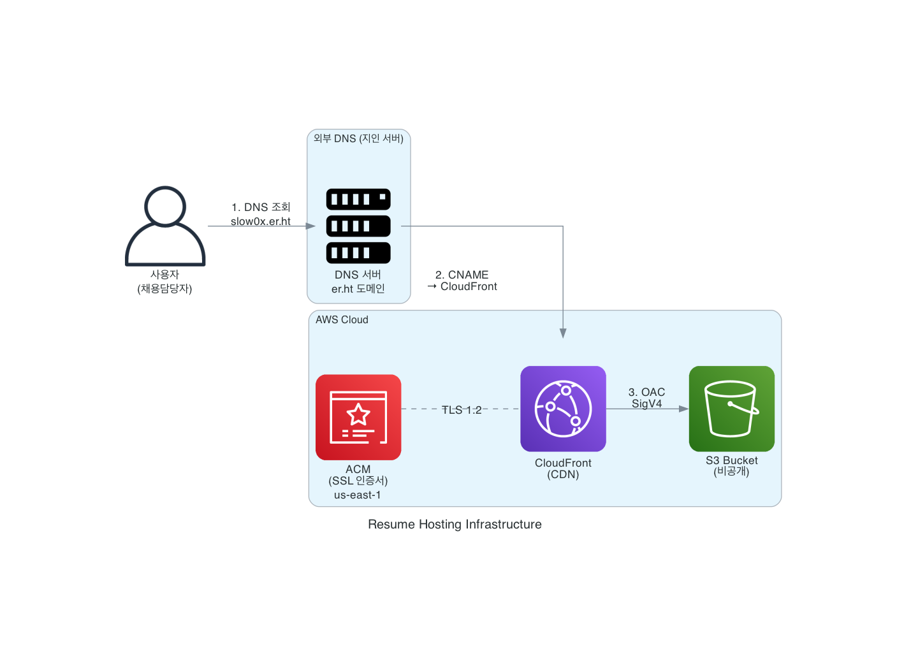

# Resume Hosting Infrastructure

Terraform을 사용하여 AWS에서 PDF 이력서를 호스팅하는 인프라입니다.

## 🤖 Vibe Coding with Kiro

이 프로젝트는 **AWS Kiro**를 사용하여 바이브 코딩(Vibe Coding) 방식으로 개발되었습니다.

Kiro의 Spec 기능을 활용하여 요구사항 정의부터 설계, 구현 태스크 관리까지 체계적으로 진행하였으며, AI 어시스턴트와의 협업을 통해 Terraform 인프라 코드와 테스트를 작성했습니다.

- **Spec 위치**: `.kiro/specs/resume-hosting-infrastructure/`

## 아키텍처



- **S3**: PDF 이력서 파일 저장 (비공개, OAC로 CloudFront만 접근)
- **CloudFront**: CDN을 통한 전 세계적 콘텐츠 전송, HTTPS 리디렉션
- **ACM**: 무료 SSL/TLS 인증서 (us-east-1)

> **참고**: Route53은 이 프로젝트에서 사용하지 않습니다. 지인의 도메인에서 서브도메인을 빌려 사용하고 있어, DNS 레코드(ACM 검증용 CNAME, CloudFront 연결용 CNAME)는 지인의 DNS 서버에서 수동으로 관리합니다.

## 현재 배포 상태

| 리소스 | 상태 | 값 |
|--------|------|-----|
| S3 버킷 | ✅ 완료 | `resume-hosting-test-20260118` |
| CloudFront | ✅ 완료 | `E27JDTW678QD8T` |
| ACM 인증서 | ✅ 발급됨 | us-east-1 |
| 커스텀 도메인 | ✅ 연결됨 | https://slow0x.er.ht/ |
| HTTPS | ✅ 활성화 | TLSv1.2_2021, SNI-only |

## 프로젝트 구조

```
terraform-s3-resume/
├── providers.tf              # AWS 프로바이더 구성
├── variables.tf              # 입력 변수 정의
├── outputs.tf                # 출력 값 정의
├── s3.tf                     # S3 버킷 리소스
├── cloudfront.tf             # CloudFront 배포 리소스
├── acm.tf                    # ACM 인증서 리소스
├── terraform.tfvars.example  # 변수 예제 파일
├── .gitignore                # Git 무시 파일
└── tests/                    # 인프라 검증 테스트
    ├── test_s3_bucket_config.py
    ├── test_oac_bucket_policy.py
    └── test_s3_metadata_property.py
```

## 사전 요구사항

1. **AWS 계정**: 활성화된 AWS 계정
2. **Terraform**: 버전 1.0 이상
3. **AWS CLI**: 구성된 AWS 자격 증명
4. **커스텀 도메인**: 외부 DNS에서 관리되는 도메인

## 초기 설정

1. **변수 파일 생성**:

   ```bash
   cp terraform.tfvars.example terraform.tfvars
   ```

2. **terraform.tfvars 편집**:
   - `bucket_name`: 전역적으로 고유한 S3 버킷 이름
   - `custom_domain`: 이력서 접근용 도메인

3. **Terraform 초기화 및 배포**:

   ```bash
   terraform init
   terraform validate
   terraform plan
   terraform apply
   ```

4. **DNS 설정** (외부 DNS 서버):
   - ACM 검증용 CNAME 레코드 추가
   - CloudFront 연결용 CNAME 레코드 추가

## 이력서 업로드

```bash
aws s3 cp resume.pdf s3://your-bucket-name/resume.pdf --content-type application/pdf
```

## 캐시 무효화

이력서 업데이트 후 CloudFront 캐시를 무효화합니다:

```bash
aws cloudfront create-invalidation --distribution-id YOUR_DIST_ID --paths '/*'
```

## 비용

이 인프라는 AWS 프리 티어 범위 내에서 작동하도록 최적화되었습니다:

- **S3**: 5GB 스토리지, 20,000 GET 요청/월
- **CloudFront**: 1TB 데이터 전송, 10,000,000 요청/월
- **ACM**: 무료

예상 월간 비용: **$0** (프리 티어 내)

## 정리

모든 리소스를 삭제하려면:

```bash
terraform destroy
```

## 테스트 실행

```bash
pip install -r tests/requirements.txt
python3 -m pytest tests/ -v
```

## 🚀 업그레이드 계획: 포트폴리오 사이트 확장

현재 이력서 호스팅 서비스를 확장하여 Astro 기반 정적 포트폴리오 사이트를 추가 구축할 예정입니다.

### 목표

기존 도메인(`https://slow0x.er.ht/`)에서 포트폴리오 사이트에 접속하여 다음 정보를 확인할 수 있도록 합니다:

- **GitHub Repository URL**: 이 프로젝트의 소스 코드 저장소 링크
- **프로젝트 아키텍처**: 인프라 구성도 (architecture diagram)
- **이력서 다운로드**: `/resume.pdf` 경로로 PDF 이력서 다운로드

### 아키텍처 방식: 단일 버킷

새로운 S3 버킷이나 CloudFront 배포를 생성하지 않고, **기존 인프라를 재활용**합니다:

| 항목 | 변경 사항 |
| ---- | --------- |
| S3 버킷 | 기존 버킷에 Astro 빌드 결과물 추가 |
| CloudFront | default_root_object를 index.html로 변경 |
| 도메인 | 기존 `slow0x.er.ht` 유지 |
| 비용 | 추가 비용 없음 (프리 티어 유지) |

### 예상 URL 구조

```text
https://slow0x.er.ht/           → 포트폴리오 메인 페이지
https://slow0x.er.ht/resume.pdf → 이력서 PDF 다운로드
```

### 상세 요구사항

자세한 요구사항은 `.kiro/specs/resume-hosting-infrastructure/requirements.md`의 **요구사항 9**를 참조하세요.

## 라이선스

이 프로젝트는 개인 사용을 위한 것입니다.
